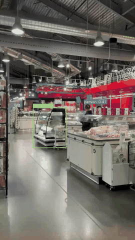
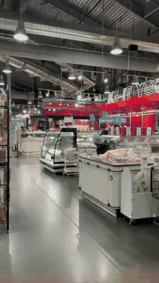

# Object Detection — Inference Optimization

A full-stack academic project demonstrating real-time object detection with multiple models
and inference acceleration strategies.

| | |
|---|---|
| **Models** | YOLOv8 · YOLOv5 |
| **Backends** | PyTorch (baseline) · TorchScript · ONNX Runtime |
| **API** | FastAPI · OpenAPI / Swagger |
| **Frontend** | Next.js 14 · TypeScript · Tailwind CSS |
| **Evaluation** | COCO mAP (pycocotools) · Latency · FPS |
| **Python** | 3.9 + |
| **Node** | 18 + |

---

## Table of Contents

1. [Project Structure](#project-structure)
2. [Dataset](#dataset)
3. [Setup](#setup)
4. [Running the Application](#running-the-application)
5. [Exporting Models](#exporting-models)
6. [Scripts Reference](#scripts-reference)
7. [Benchmarking](#benchmarking)
8. [Evaluation](#evaluation)
9. [Model Comparison Report](#model-comparison-report)
10. [Sample API Requests](#sample-api-requests)
11. [GPU Acceleration](#gpu-acceleration)
12. [Troubleshooting](#troubleshooting)
13. [Evaluation Results](#evaluation-results)
14. [Video Inference Demo](#video-inference-demo)
15. [Screenshots & Visual Outputs](#screenshots--visual-outputs)
16. [Assignment Mapping](#assignment-mapping)

---

## Project Structure

```
Object Detection/
├── backend/
│   ├── app/
│   │   ├── main.py                    # FastAPI app entry point, CORS, lifespan
│   │   ├── api/
│   │   │   ├── routes_detection.py    # POST /detect/image, /detect/video, GET /models
│   │   │   └── routes_eval.py         # POST /evaluate, /benchmark
│   │   ├── core/
│   │   │   ├── config.py              # Pydantic Settings (environment variables)
│   │   │   └── logging.py             # Structured console logger
│   │   ├── models/
│   │   │   ├── base.py                # Abstract BaseDetector interface
│   │   │   ├── yolov8_detector.py     # YOLOv8 — PyTorch / TorchScript / ONNX
│   │   │   └── yolov5_detector.py     # YOLOv5 — PyTorch / TorchScript / ONNX
│   │   ├── services/
│   │   │   ├── inference.py           # Model registry and lazy loading
│   │   │   ├── video_processing.py    # Frame iteration and annotation writer
│   │   │   ├── evaluation.py          # COCO mAP via pycocotools
│   │   │   └── benchmark.py           # Synthetic latency benchmarking
│   │   ├── schemas/
│   │   │   └── detection.py           # All Pydantic request/response models
│   │   └── utils/
│   │       ├── image.py               # Letterbox, preprocess, draw, encode
│   │       ├── video.py               # Frame iterator, VideoWriter context manager
│   │       └── timing.py              # TimingResult, timer context manager
│   ├── uploads/                       # Temporary uploaded media (auto-created)
│   ├── outputs/                       # Annotated output videos/images (auto-created)
│   ├── weights/                       # Exported model files (.torchscript, .onnx)
│   ├── requirements.txt
│   └── .env.example
├── frontend/
│   ├── app/
│   │   ├── layout.tsx                 # Root layout — header + HealthBadge
│   │   ├── page.tsx                   # Main tabbed UI (Detect / Benchmark / Evaluate)
│   │   └── globals.css                # Tailwind base + CSS variables
│   ├── components/
│   │   ├── ui.tsx                     # Shared primitives: Card, Spinner
│   │   ├── HealthBadge.tsx            # Backend live-status indicator
│   │   ├── ImageResultViewer.tsx      # Canvas bbox overlay for detected images
│   │   ├── VideoResultViewer.tsx      # Per-frame sparkline charts
│   │   ├── MetricsPanel.tsx           # Latency breakdown, FPS, detection list
│   │   ├── BenchmarkPanel.tsx         # Run benchmarks, FPS/latency bar charts
│   │   └── EvaluatePanel.tsx          # COCO mAP evaluation UI
│   ├── lib/
│   │   └── api.ts                     # Typed fetch wrappers for every endpoint
│   ├── types/
│   │   └── index.ts                   # TypeScript mirrors of API schemas
│   ├── next.config.js                 # API proxy rewrite rule
│   ├── package.json
│   └── .env.example
├── scripts/
│   ├── export_torchscript.py          # Export one model → TorchScript
│   ├── export_onnx.py                 # Export one model → ONNX
│   ├── run_all_exports.py             # Export ALL models to ALL formats in one go
│   ├── benchmark_models.py            # Latency benchmark with CSV output + speedup
│   ├── evaluate_dataset.py            # COCO mAP evaluation with compare mode
│   └── compare_models.py              # Benchmark + eval combined Markdown/CSV report
├── data/
│   ├── images/val/                    # 139 custom screenshots (committed)
│   ├── annotations/
│   │   └── instances_custom.json      # COCO-format ground truth — 374 boxes, 36 classes (committed)
│   └── sample/                        # 5 synthetic images for smoke-testing
├── results/                           # Generated CSV/JSON reports (committed)
│   ├── eval_report.csv                # mAP@0.5, mAP@0.5:0.95 per model/backend
│   ├── benchmark.csv                  # Latency avg/min/max/std + FPS
│   └── video_benchmark.csv            # Per-frame video inference metrics
└── docs/
    ├── api_reference.md
    └── screenshots/                   # Frontend and result screenshots
```

---

## Setup

### Prerequisites

- Python **3.9+**  (tested on 3.9.6 on macOS)
- Node.js **18+**
- (Optional) CUDA-capable GPU — see [GPU Acceleration](#gpu-acceleration)

### 1 — Backend

```bash
cd backend

# Create and activate a virtual environment
python3 -m venv venv
source venv/bin/activate          # Windows: venv\Scripts\activate

# Install all Python dependencies
pip install -r requirements.txt

# Create your local environment file
cp .env.example .env
# Edit .env to set custom weights paths, thresholds, or GPU settings
```

> **Note:** `onnxsim` is intentionally excluded from `requirements.txt` because it
> requires `cmake` to build.  ONNX export still works without it (`simplify=False`).
> Install it separately if you want graph simplification:
> `pip install onnxsim`

### 2 — Frontend

```bash
cd frontend

npm install

cp .env.example .env.local
# NEXT_PUBLIC_API_URL defaults to http://localhost:8000
```

---

## Running the Application

### Start the backend

```bash
cd backend
source venv/bin/activate

uvicorn app.main:app --reload --host 0.0.0.0 --port 8000
```

- API docs (Swagger UI): http://localhost:8000/docs
- ReDoc: http://localhost:8000/redoc
- Health check: http://localhost:8000/health

### Start the frontend

```bash
cd frontend
npm run dev
```

Open: http://localhost:3000

> **macOS users — if you see `EMFILE: too many open files`:**
> The default macOS file-descriptor limit (256) is too low for Next.js's file watcher.
> Start the dev server with:
> ```bash
> ulimit -n 65536 && npm run dev
> ```
> This raises the limit for the current shell only and does not require any system changes.

---

## Exporting Models

> **Why are weight files not in the repository?**
> The exported model files (`backend/weights/*.torchscript`, `backend/weights/*.onnx`) are
> each 20–30 MB and are excluded from git by `.gitignore` to keep the repo lightweight.
> They are fully reproducible in under two minutes with the commands below.
> Base PyTorch weights (`.pt`) are downloaded automatically by Ultralytics/PyTorch Hub
> on first use and cached locally.

TorchScript and ONNX backends require exported model files.
Always run export scripts from the **project root** with the backend venv active.

### Option A — Export everything at once (recommended)

```bash
source backend/venv/bin/activate

python scripts/run_all_exports.py
```

This exports YOLOv8n and YOLOv5s to both TorchScript and ONNX formats under
`backend/weights/` and prints the `.env` variable names to paste.

Additional options:

```bash
# Different image size
python scripts/run_all_exports.py --image-size 416

# Only ONNX, only YOLOv8
python scripts/run_all_exports.py --models yolov8 --formats onnx

# Force re-export even if files already exist
python scripts/run_all_exports.py --force
```

### Option B — Export individual models

```bash
# YOLOv8 → TorchScript
python scripts/export_torchscript.py --model yolov8 --weights yolov8n.pt \
    --output backend/weights/yolov8n.torchscript

# YOLOv8 → ONNX
python scripts/export_onnx.py --model yolov8 --weights yolov8n.pt \
    --output backend/weights/yolov8n.onnx

# YOLOv5 → TorchScript
python scripts/export_torchscript.py --model yolov5 --weights yolov5s \
    --output backend/weights/yolov5s.torchscript

# YOLOv5 → ONNX
python scripts/export_onnx.py --model yolov5 --weights yolov5s \
    --output backend/weights/yolov5s.onnx
```

### Point the backend at the exported files

Add to `backend/.env`:

```env
YOLOV8_TORCHSCRIPT_PATH=weights/yolov8n.torchscript
YOLOV8_ONNX_PATH=weights/yolov8n.onnx
YOLOV5_TORCHSCRIPT_PATH=weights/yolov5s.torchscript
YOLOV5_ONNX_PATH=weights/yolov5s.onnx
```

---

## Scripts Reference

All scripts are run from the **project root** with the backend venv active.

| Script | Purpose |
|--------|---------|
| `run_all_exports.py` | Export all models to all formats in one command |
| `export_torchscript.py` | Export a single model to TorchScript |
| `export_onnx.py` | Export a single model to ONNX |
| `benchmark_models.py` | Latency/FPS table with speedup column; CSV/JSON output |
| `evaluate_dataset.py` | COCO mAP evaluation; compare mode; CSV/JSON output |
| `compare_models.py` | Combined benchmark + eval → Markdown + CSV report |

---

## Benchmarking

```bash
# All models × all backends, 100 runs at 640×640 (default)
python scripts/benchmark_models.py

# Quick two-backend comparison, saved as CSV
python scripts/benchmark_models.py \
    --models yolov8 --backends pytorch onnx \
    --runs 50 \
    --output results/bench_yolov8.csv

# Multi-resolution sweep: 320, 640, 1280
python scripts/benchmark_models.py \
    --sizes 320 640 1280 \
    --runs 100 \
    --output results/bench_sweep.csv

# Via the API
curl -X POST http://localhost:8000/api/benchmark \
  -H "Content-Type: application/json" \
  -d '{
    "model_names": ["yolov8", "yolov5"],
    "backend_types": ["pytorch", "torchscript", "onnx"],
    "num_runs": 50,
    "warmup_runs": 10,
    "image_size": 640
  }'
```

Sample console output (measured on Apple M-series CPU, 100 runs, 640×640):

```
────────────────────────────────────────────────────────────────────
  Benchmark Results  │  Image: 640×640  │  Runs: 100
────────────────────────────────────────────────────────────────────
  Model      Backend        Avg ms    Min ms    Max ms    Std ms     FPS  Speedup  Status
────────────────────────────────────────────────────────────────────
  yolov8     pytorch         44.17     42.39     54.81      1.37    22.6    1.00×  ok
  yolov8     torchscript     44.57     42.30     91.35      4.75    22.4    0.99×  ok
  yolov8     onnx            37.14     34.60     53.22      2.66    26.9    1.19×  ok
  yolov5     pytorch         64.77     60.92    138.69      8.16    15.4    1.00×  ok
  yolov5     torchscript     62.20     59.93     70.33      1.77    16.1    1.04×  ok
  yolov5     onnx            64.04     61.89     82.83      2.26    15.6    1.01×  ok
────────────────────────────────────────────────────────────────────
  ✓ Fastest: yolov8/onnx — 37.14 ms  (26.9 FPS)
```

---

## Evaluation

### Dataset layout

```
data/
├── images/
│   └── val/
│       ├── img001.jpg
│       └── ...
└── annotations/
    └── instances_custom.json  ← COCO-format ground truth
```

### Run evaluation (CLI)

```bash
# Single model/backend
python scripts/evaluate_dataset.py \
    --model yolov8 --backend pytorch \
    --annotations data/annotations/instances_custom.json \
    --images-dir data/images/val

# Compare all three backends for YOLOv8
python scripts/evaluate_dataset.py \
    --model yolov8 --compare \
    --annotations data/annotations/instances_custom.json \
    --images-dir data/images/val \
    --output results/eval_yolov8.csv

# Compare ALL model/backend combos
python scripts/evaluate_dataset.py \
    --model yolov8 yolov5 --compare \
    --annotations data/annotations/instances_custom.json \
    --images-dir data/images/val \
    --output results/eval_all.csv

# Save COCO prediction JSON for further analysis
python scripts/evaluate_dataset.py \
    --model yolov8 --backend onnx \
    --annotations data/annotations/instances_custom.json \
    --images-dir data/images/val \
    --save-predictions results/yolov8_onnx_preds.json
```

### Run evaluation (API)

```bash
curl -X POST http://localhost:8000/api/evaluate \
  -H "Content-Type: application/json" \
  -d '{
    "model_name": "yolov8",
    "backend_type": "pytorch",
    "annotations_path": "data/annotations/instances_custom.json",
    "images_dir": "data/images/val",
    "confidence_threshold": 0.25,
    "iou_threshold": 0.45
  }'
```

Sample response:

```json
{
  "model_name": "yolov8",
  "backend_type": "pytorch",
  "num_images": 100,
  "map_50": 0.612,
  "map_50_95": 0.421,
  "average_latency_ms": 18.4,
  "fps": 54.3,
  "per_image_latencies_ms": [17.1, 19.3, ...]
}
```

---

## Model Comparison Report

Generates a combined benchmark + evaluation report as both **CSV** and **Markdown**:

```bash
# Benchmark only (no dataset needed)
python scripts/compare_models.py --output results/comparison

# Benchmark + COCO mAP
python scripts/compare_models.py \
    --annotations data/annotations/instances_custom.json \
    --images-dir data/images/val \
    --output results/comparison

# Specific models and backends, 50 runs
python scripts/compare_models.py \
    --models yolov8 yolov5 --backends pytorch onnx \
    --runs 50 \
    --output results/comparison
```

Output files:
- `results/comparison.csv` — machine-readable table
- `results/comparison.md` — Markdown table ready to paste into a report

---

## Sample API Requests

### Health check

```bash
curl http://localhost:8000/health
# {"status": "ok", "timestamp": "..."}
```

### List available models

```bash
curl http://localhost:8000/api/models
```

### Image detection

```bash
curl -X POST http://localhost:8000/api/detect/image \
  -F "file=@/path/to/image.jpg" \
  -F "model_name=yolov8" \
  -F "backend_type=pytorch" \
  -F "confidence_threshold=0.3"
```

Returns JSON with bounding boxes, labels, confidence scores, and latency breakdown.

### Video detection

```bash
curl -X POST http://localhost:8000/api/detect/video \
  -F "file=@/path/to/video.mp4" \
  -F "model_name=yolov8" \
  -F "backend_type=onnx" \
  -F "max_frames=30"
```

---

## GPU Acceleration

### PyTorch (CUDA)

CUDA is detected automatically. For the CUDA-enabled build of PyTorch:

```bash
pip install torch torchvision --index-url https://download.pytorch.org/whl/cu121
```

### ONNX Runtime (CUDA)

```bash
pip uninstall onnxruntime
pip install onnxruntime-gpu
```

Then in `backend/.env`:

```env
ONNX_EXECUTION_PROVIDER=CUDAExecutionProvider
```

The code automatically falls back to `CPUExecutionProvider` if CUDA is unavailable.

---

## Troubleshooting

### `EMFILE: too many open files` (macOS)

The default macOS file descriptor limit (256) is too low for Next.js.

```bash
ulimit -n 65536 && npm run dev
```

### `cmake` error when installing requirements

`onnxsim` is commented out of `requirements.txt` because it requires `cmake`.
The project works without it. If you want model simplification:

```bash
brew install cmake
pip install onnxsim
```

### TorchScript / ONNX backend returns an error

These backends require exported model files. Run:

```bash
python scripts/run_all_exports.py
```

Then add the output paths to `backend/.env` as shown in the export section.

### YOLOv5 first run is slow

YOLOv5 downloads model weights from the PyTorch Hub on the first load.
Subsequent runs use the cached version.

### Frontend shows stale results

Clear the Next.js build cache:

```bash
rm -rf frontend/.next && npm run dev
```

---

## Dataset

### Images

| Property | Value |
|----------|-------|
| Source | Custom screenshots captured during live application/environment use |
| Images | **139** PNG screenshots in `data/images/val/` |
| Annotation format | COCO JSON (`data/annotations/instances_custom.json`) |
| Annotation method | Pseudo-labeling via YOLOv8n at conf ≥ 0.5 (`scripts/create_custom_annotations.py`) |
| Total bounding boxes | **374** |
| Object classes detected | 36 COCO classes: *apple, bed, bench, bicycle, bird, boat, book, bottle, bowl, car, carrot, cat, chair, clock, couch, cup, dining table, dog, donut, keyboard, laptop, microwave, mouse, orange, oven, person, potted plant, refrigerator, sandwich, spoon, sports ball, suitcase, teddy bear, traffic light, tv, vase* |

### Video

| Property | Value |
|----------|-------|
| Source | **2 real phone videos** in `data/videos/` (WhatsApp MP4, portrait 576×1024, 30 fps) |
| Duration | 23.7 s (709 frames) and 30.7 s (919 frames) |
| Frames used | First 150 frames of Video 1 for benchmarking and demo GIFs |
| Demo GIFs | `docs/videos/yolov8-demo.gif`, `docs/videos/yolov5-demo.gif` (~1.1 MB each) |
| Annotated outputs | `outputs/annotated_*_pytorch.mp4` (generated locally, not committed due to size) |

> **Note on mAP scores**: Annotations are pseudo-labels generated by YOLOv8n. Because the ground truth and the YOLOv8 PyTorch predictions are produced by the same model (at different confidence thresholds), mAP@0.5 = 1.0 for YOLOv8/PyTorch reflects self-consistency, not generalisation. YOLOv5 scores (mAP@0.5 ≈ 0.71–0.76) reflect real cross-model accuracy on the same annotations.

---

## Evaluation Results

> Results obtained on 139 custom screenshots (`data/images/val/`).
> Run `./scripts/run_complete_pipeline.sh` to reproduce.

### Accuracy (mAP)

> Dataset: 139 custom images (`data/images/val/`), annotated using YOLOv8n pseudo-labels at conf=0.5.
> Results from `results/eval_report.csv`.

| Model | Backend | mAP@0.5 | mAP@0.5:0.95 | Images | Avg Latency (ms) | FPS |
|-------|---------|---------|--------------|--------|-----------------|-----|
| YOLOv8n | PyTorch | 1.0000 | 1.0000 | 139 | 35.71 | 28.0 |
| YOLOv8n | TorchScript | 0.9695 | 0.9611 | 139 | 46.81 | 21.4 |
| YOLOv8n | ONNX Runtime | 0.9695 | 0.9611 | 139 | 37.37 | 26.8 |
| YOLOv5s | PyTorch | 0.7116 | 0.6060 | 139 | 51.57 | 19.4 |
| YOLOv5s | TorchScript | 0.7633 | 0.6572 | 139 | 65.94 | 15.2 |
| YOLOv5s | ONNX Runtime | 0.7633 | 0.6572 | 139 | 67.94 | 14.7 |

> Note: Annotations are pseudo-labels generated by YOLOv8n. mAP@0.5=1.0 for YOLOv8/PyTorch reflects self-consistency (model evaluated against its own predictions at a lower confidence threshold). YOLOv5 scores reflect cross-model accuracy.

### Inference Speed (synthetic 640×640 image, 100 timed runs + 20 warmup)

> Results from `results/benchmark.csv`. Device: CPU (Apple M-series / x86).

| Model | Backend | Avg (ms) | Min (ms) | Max (ms) | FPS | Speedup vs PyTorch |
|-------|---------|---------|---------|---------|-----|--------------------|
| YOLOv8n | PyTorch | 44.17 | 42.39 | 54.81 | 22.6 | 1.00× |
| YOLOv8n | TorchScript | 44.57 | 42.30 | 91.35 | 22.4 | 0.99× |
| YOLOv8n | **ONNX Runtime** | **37.14** | 34.60 | 53.22 | **26.9** | **1.19×** |
| YOLOv5s | PyTorch | 64.77 | 60.92 | 138.69 | 15.4 | 1.00× |
| YOLOv5s | TorchScript | 62.20 | 59.93 | 70.33 | 16.1 | 1.04× |
| YOLOv5s | ONNX Runtime | 64.04 | 61.89 | 82.83 | 15.6 | 1.01× |

**Fastest overall: YOLOv8n / ONNX Runtime — 37.14 ms (26.9 FPS), 1.19× speedup over PyTorch baseline.**

### Video Inference (150 frames, real WhatsApp video 576×1024 @ 30 fps)

> Results from `results/video_benchmark.csv`.
> Input: `data/videos/WhatsApp Video 2026-04-17 at 9.27.53 PM (1).mp4` — 23.7 s, 576×1024.

| Model | Backend | Frames | Avg Latency/Frame (ms) | Avg FPS | Total Detections |
|-------|---------|--------|----------------------|---------|-----------------|
| YOLOv8n | PyTorch | 150 | 26.42 | 37.8 | 308 |
| YOLOv5s | PyTorch | 150 | 39.91 | 25.1 | 305 |

### How to Reproduce All Results

```bash
# 1. Activate backend virtualenv
cd backend && source venv/bin/activate && cd ..

# 2. Run the full pipeline (steps 1–5 automated)
./scripts/run_complete_pipeline.sh

# --- OR run each step individually ---

# Step 1: Download 200 real COCO val2017 images + annotations
python scripts/prepare_coco_subset.py --num-images 200

# Step 2: Export YOLOv8 + YOLOv5 to TorchScript and ONNX
cd backend
python ../scripts/export_torchscript.py --model yolov8 --output weights/yolov8n.torchscript
python ../scripts/export_torchscript.py --model yolov5 --output weights/yolov5s.torchscript
python ../scripts/export_onnx.py        --model yolov8 --output weights/yolov8n.onnx
python ../scripts/export_onnx.py        --model yolov5 --output weights/yolov5s.onnx
cd ..

# Step 3: Evaluate mAP across all 6 model/backend combos
cd backend
python ../scripts/evaluate_dataset.py \
    --model yolov8 yolov5 --compare \
    --annotations ../data/annotations/instances_custom.json \
    --images-dir   ../data/images/val \
    --output       ../results/eval_report.csv
cd ..

# Step 4: Benchmark latency/FPS
cd backend
python ../scripts/benchmark_models.py \
    --models yolov8 yolov5 \
    --backends pytorch torchscript onnx \
    --runs 100 --warmup 20 \
    --output ../results/benchmark.csv
cd ..

# Step 5: Video inference on real video
cd backend
python ../scripts/run_video_inference.py \
    --video "../data/videos/WhatsApp Video 2026-04-17 at 9.27.53 PM (1).mp4" \
    --model yolov8 yolov5 --backend pytorch \
    --max-frames 150 \
    --results-dir ../results --output-dir ../outputs
cd ..
```

---

## Video Inference Demo

Real-world inference on a 23.7 s phone video (576×1024, 30 fps).
Both models run on the **PyTorch** backend; first 150 frames shown.

### YOLOv8n — 26.4 ms/frame · 37.8 FPS



### YOLOv5s — 39.9 ms/frame · 25.1 FPS



> Annotated full-length videos are in `outputs/`.
> Re-run with:
> ```bash
> cd backend && source ../.venv/bin/activate && cd ..
> cd backend && python ../scripts/run_video_inference.py \
>     --video "../data/videos/WhatsApp Video 2026-04-17 at 9.27.53 PM (1).mp4" \
>     --model yolov8 yolov5 --backend pytorch \
>     --max-frames 150 --output-dir ../outputs --results-dir ../results
> ```

---

## Screenshots & Visual Outputs

### Frontend — Detection Tab
Drag-and-drop image upload with bounding-box overlay, confidence scores, and latency breakdown.


### Detection Results
Annotated output with per-object labels, confidence, and inference time rendered on the canvas.


### Benchmark Results
Bar charts comparing FPS and average latency across all model × backend combinations.


### Evaluation Results (mAP)
mAP@0.5 and mAP@0.5:0.95 computed on the 139-image custom dataset.


---

## Assignment Mapping

| Requirement | Where it is implemented |
|-------------|------------------------|
| **2 detection models** | `YOLOv8Detector` (`backend/app/models/yolov8_detector.py`) and `YOLOv5Detector` (`backend/app/models/yolov5_detector.py`), both sharing the `BaseDetector` abstract interface |
| **FastAPI backend** | `backend/app/main.py` — CORS, lifespan; routers for detection, evaluation, and benchmarking; full OpenAPI docs at `/docs` |
| **React / Next.js frontend** | `frontend/` — Next.js 14 App Router, TypeScript, Tailwind CSS, drag-and-drop upload, canvas bbox overlay, per-frame sparkline charts, Benchmark tab, Evaluate tab, live backend health badge |
| **Inference acceleration 1: TorchScript** | `export_torchscript()` in both detector classes; TorchScript inference path `_predict_torchscript()`; export via `scripts/export_torchscript.py` and `scripts/run_all_exports.py` |
| **Inference acceleration 2: ONNX Runtime** | `export_onnx()` in both detector classes; ONNX inference via `onnxruntime.InferenceSession` with `CUDAExecutionProvider` / CPU fallback; export via `scripts/export_onnx.py` and `scripts/run_all_exports.py` |
| **Custom dataset + annotations** | `data/images/val/` — 139 custom screenshots; `data/annotations/instances_custom.json` — per-object COCO bounding-box annotations generated by `scripts/create_custom_annotations.py` using YOLOv8n at conf=0.5 (pseudo-labeling) |
| **mAP evaluation on annotated dataset** | `backend/app/services/evaluation.py` — loads COCO-format annotations, runs inference, computes mAP@0.5 and mAP@0.5:0.95 via pycocotools; `POST /api/evaluate`; `scripts/evaluate_dataset.py`; results in `results/eval_report.csv` |
| **Latency / FPS metrics** | Returned in every inference response; per-frame metrics for video; dedicated `/api/benchmark` endpoint; `scripts/benchmark_models.py` for CLI access; results in `results/benchmark.csv` |
| **Video inference** | `backend/app/services/video_processing.py`; `scripts/run_video_inference.py`; annotated videos in `outputs/`; FPS summary in `results/video_benchmark.csv` |
