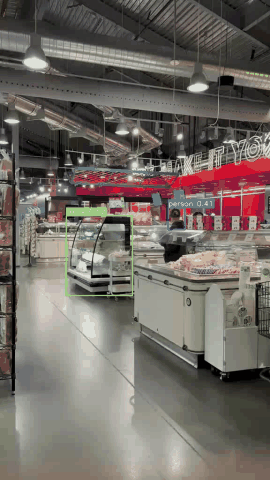

# Object Detection — Inference Optimization

A full-stack academic project demonstrating real-time object detection with multiple models
and inference acceleration strategies.

| | |
|---|---|
| **Models** | YOLOv8 · YOLOv5 |
| **Backends** | PyTorch · TorchScript · ONNX Runtime (FP32) · ONNX INT8 Quantized · CoreML (Apple Silicon) |
| **API** | FastAPI · REST · OpenAPI / Swagger docs |
| **Frontend** | Next.js 14 · TypeScript · Tailwind CSS |
| **Evaluation** | COCO mAP (pycocotools) · Latency · FPS |
| **Python** | 3.9 + |
| **Node** | 18 + |
| **Acceleration** | CPU baseline committed · CoreML (Apple Silicon) · CUDA/TensorRT (NVIDIA GPU) — see [GPU Acceleration](#gpu-acceleration) |

---

## Table of Contents

1. [Project Structure](#project-structure)
2. [Dataset](#dataset)
3. [Setup](#setup)
4. [Running the Application](#running-the-application)
5. [Exporting Models](#exporting-models)
6. [Scripts Reference](#scripts-reference)
7. [Benchmarking](#benchmarking)
8. [Evaluation](#evaluation)
9. [Manual Annotation Workflow](#manual-annotation-workflow)
10. [Final Evaluation Protocol](#final-evaluation-protocol)
11. [Model Comparison Report](#model-comparison-report)
12. [Sample API Requests](#sample-api-requests)
13. [GPU Acceleration](#gpu-acceleration)
14. [Troubleshooting](#troubleshooting)
15. [Evaluation Results](#evaluation-results)
16. [Video Inference Demo](#video-inference-demo)
17. [Screenshots & Visual Outputs](#screenshots--visual-outputs)
18. [Assignment Mapping](#assignment-mapping)

---

## Project Structure

```
Object Detection/
├── backend/
│   ├── app/
│   │   ├── main.py                    # FastAPI app entry point, CORS, lifespan
│   │   ├── api/
│   │   │   ├── routes_detection.py    # POST /detect/image, /detect/video, GET /models
│   │   │   └── routes_eval.py         # POST /evaluate, /benchmark
│   │   ├── core/
│   │   │   ├── config.py              # Pydantic Settings (environment variables)
│   │   │   └── logging.py             # Structured console logger
│   │   ├── models/
│   │   │   ├── base.py                # Abstract BaseDetector interface
│   │   │   ├── yolov8_detector.py     # YOLOv8 — PyTorch / TorchScript / ONNX
│   │   │   └── yolov5_detector.py     # YOLOv5 — PyTorch / TorchScript / ONNX
│   │   ├── services/
│   │   │   ├── inference.py           # Model registry and lazy loading
│   │   │   ├── video_processing.py    # Frame iteration and annotation writer
│   │   │   ├── evaluation.py          # COCO mAP via pycocotools
│   │   │   └── benchmark.py           # Synthetic latency benchmarking
│   │   ├── schemas/
│   │   │   └── detection.py           # All Pydantic request/response models
│   │   └── utils/
│   │       ├── image.py               # Letterbox, preprocess, draw, encode
│   │       ├── video.py               # Frame iterator, VideoWriter context manager
│   │       └── timing.py              # TimingResult, timer context manager
│   ├── uploads/                       # Temporary uploaded media (auto-created)
│   ├── outputs/                       # Annotated output videos/images (auto-created)
│   ├── weights/                       # Exported model files (.torchscript, .onnx)
│   ├── requirements.txt
│   └── .env.example
├── frontend/
│   ├── app/
│   │   ├── layout.tsx                 # Root layout — header + HealthBadge
│   │   ├── page.tsx                   # Main tabbed UI (Detect / Benchmark / Evaluate)
│   │   └── globals.css                # Tailwind base + CSS variables
│   ├── components/
│   │   ├── ui.tsx                     # Shared primitives: Card, Spinner
│   │   ├── HealthBadge.tsx            # Backend live-status indicator
│   │   ├── ImageResultViewer.tsx      # Canvas bbox overlay for detected images
│   │   ├── VideoResultViewer.tsx      # Per-frame sparkline charts
│   │   ├── MetricsPanel.tsx           # Latency breakdown, FPS, detection list
│   │   ├── BenchmarkPanel.tsx         # Run benchmarks, FPS/latency bar charts
│   │   └── EvaluatePanel.tsx          # COCO mAP evaluation UI
│   ├── lib/
│   │   └── api.ts                     # Typed fetch wrappers for every endpoint
│   ├── types/
│   │   └── index.ts                   # TypeScript mirrors of API schemas
│   ├── next.config.js                 # API proxy rewrite rule
│   ├── package.json
│   └── .env.example
├── scripts/
│   ├── export_torchscript.py          # Export one model → TorchScript
│   ├── export_onnx.py                 # Export one model → ONNX
│   ├── run_all_exports.py             # Export ALL models to ALL formats in one go
│   ├── benchmark_models.py            # Latency benchmark with CSV output + speedup
│   ├── evaluate_dataset.py            # COCO mAP evaluation with compare mode
│   └── compare_models.py              # Benchmark + eval combined Markdown/CSV report
├── data/
│   ├── images/val/                    # 139 custom screenshots (committed)
│   ├── annotations/
│   │   ├── instances_manual.json      # Manual COCO ground truth — 59 images, 136 boxes (final mAP)
│   │   ├── instances_custom.json      # YOLO-generated pseudo-labels — sanity check only
│   └── sample/                        # 5 synthetic images for smoke-testing
├── results/                           # Generated CSV/JSON reports (committed)
│   ├── eval_report.csv                # mAP@0.5, mAP@0.5:0.95 per model/backend (pseudo-labels)
│   ├── eval_report_manual.csv         # mAP@0.5, mAP@0.5:0.95 — manual annotations (submission)
│   ├── benchmark.csv                  # Latency avg/min/max/std + FPS (incl. CoreML rows)
│   ├── benchmark_cuda.csv             # CUDA GPU benchmark — CUDAExecutionProvider results
│   └── video_benchmark.csv            # Per-frame video inference metrics
└── docs/
    ├── api_reference.md
    └── screenshots/                   # Frontend and result screenshots
```

---

## Setup

### Prerequisites

- Python **3.9+**  (tested on 3.9.6 on macOS)
- Node.js **18+**
- (Optional) CUDA-capable GPU — see [GPU Acceleration](#gpu-acceleration)

### 1 — Backend

```bash
cd backend

# Create and activate a virtual environment
python3 -m venv venv
source venv/bin/activate          # Windows: venv\Scripts\activate

# Install all Python dependencies
pip install -r requirements.txt

# Create your local environment file
cp .env.example .env
# Edit .env to set custom weights paths, thresholds, or GPU settings
```

> **Note:** `onnxsim` is intentionally excluded from `requirements.txt` because it
> requires `cmake` to build.  ONNX export still works without it (`simplify=False`).
> Install it separately if you want graph simplification:
> `pip install onnxsim`

### 2 — Frontend

```bash
cd frontend

npm install

cp .env.example .env.local
# NEXT_PUBLIC_API_URL defaults to http://localhost:8000
```

---

## Running the Application

### Start the backend

```bash
cd backend
source venv/bin/activate

uvicorn app.main:app --reload --host 0.0.0.0 --port 8000
```

- API docs (Swagger UI): http://localhost:8000/docs
- ReDoc: http://localhost:8000/redoc
- Health check: http://localhost:8000/health

### Start the frontend

```bash
cd frontend
npm run dev
```

Open: http://localhost:3000

> **macOS users — if you see `EMFILE: too many open files`:**
> The default macOS file-descriptor limit (256) is too low for Next.js's file watcher.
> Start the dev server with:
> ```bash
> ulimit -n 65536 && npm run dev
> ```
> This raises the limit for the current shell only and does not require any system changes.

---

## Exporting Models

> **Why are weight files not in the repository?**
> The exported model files (`backend/weights/*.torchscript`, `backend/weights/*.onnx`) are
> each 20–30 MB and are excluded from git by `.gitignore` to keep the repo lightweight.
> They are fully reproducible in under two minutes with the commands below.
> Base PyTorch weights (`.pt`) are downloaded automatically by Ultralytics/PyTorch Hub
> on first use and cached locally.

TorchScript and ONNX backends require exported model files.
Always run export scripts from the **project root** with the backend venv active.

### Option A — Export everything at once (recommended)

```bash
source backend/venv/bin/activate

python scripts/run_all_exports.py
```

This exports YOLOv8n and YOLOv5s to both TorchScript and ONNX formats under
`backend/weights/` and prints the `.env` variable names to paste.

Additional options:

```bash
# Different image size
python scripts/run_all_exports.py --image-size 416

# Only ONNX, only YOLOv8
python scripts/run_all_exports.py --models yolov8 --formats onnx

# Force re-export even if files already exist
python scripts/run_all_exports.py --force
```

### Option B — Export individual models

```bash
# YOLOv8 → TorchScript
python scripts/export_torchscript.py --model yolov8 --weights yolov8n.pt \
    --output backend/weights/yolov8n.torchscript

# YOLOv8 → ONNX
python scripts/export_onnx.py --model yolov8 --weights yolov8n.pt \
    --output backend/weights/yolov8n.onnx

# YOLOv5 → TorchScript
python scripts/export_torchscript.py --model yolov5 --weights yolov5s \
    --output backend/weights/yolov5s.torchscript

# YOLOv5 → ONNX
python scripts/export_onnx.py --model yolov5 --weights yolov5s \
    --output backend/weights/yolov5s.onnx

# Option C — INT8 dynamic quantization (run AFTER Option A or B)
# Requires the FP32 .onnx files above; reduces model size ~3.5× with no calibration data
python scripts/export_onnx_quant.py
# Outputs: backend/weights/yolov8n_int8.onnx, backend/weights/yolov5s_int8.onnx
```

### Point the backend at the exported files

Add to `backend/.env`:

```env
YOLOV8_TORCHSCRIPT_PATH=weights/yolov8n.torchscript
YOLOV8_ONNX_PATH=weights/yolov8n.onnx
YOLOV5_TORCHSCRIPT_PATH=weights/yolov5s.torchscript
YOLOV5_ONNX_PATH=weights/yolov5s.onnx
```

---

## Scripts Reference

All scripts are run from the **project root** with the backend venv active.

| Script | Purpose |
|--------|---------|
| `run_all_exports.py` | Export all models to all formats in one command |
| `export_torchscript.py` | Export a single model to TorchScript |
| `export_onnx.py` | Export a single model to ONNX (FP32) |
| `export_onnx_quant.py` | INT8 dynamic quantization of exported ONNX models |
| `benchmark_models.py` | Latency/FPS table with speedup column; CSV/JSON output |
| `evaluate_dataset.py` | COCO mAP evaluation; `--annotation-type manual/pseudo`; CSV/JSON output |
| `validate_annotations.py` | **New** — check whether an annotation file is human-created or pseudo-labels |
| `run_video_inference.py` | Video inference on both models; per-frame CSV + annotated video |
| `compare_models.py` | Combined benchmark + eval → Markdown + CSV report |
| `create_custom_annotations.py` | Generate pseudo-label annotations (sanity-check only) |

---

## Benchmarking

```bash
# All models × all backends, 100 runs at 640×640 (default, CPU-only)
python scripts/benchmark_models.py

# Quick two-backend comparison, saved as CSV
python scripts/benchmark_models.py \
    --models yolov8 --backends pytorch onnx \
    --runs 50 \
    --output results/bench_yolov8.csv

# Multi-resolution sweep: 320, 640, 1280
python scripts/benchmark_models.py \
    --sizes 320 640 1280 \
    --runs 100 \
    --output results/bench_sweep.csv

# Apple Silicon — CoreML hardware acceleration (requires onnxruntime-silicon)
# pip install onnxruntime-silicon
python scripts/benchmark_models.py \
    --models yolov8 yolov5 \
    --backends pytorch torchscript onnx onnx_quant coreml \
    --runs 100 --warmup 20 \
    --output results/benchmark_coreml.csv
# Check actual_provider=CoreMLExecutionProvider and hardware_accelerated=True in output

# NVIDIA GPU — CUDA acceleration (requires onnxruntime-gpu + CUDA 11+)
# pip install onnxruntime-gpu
python scripts/benchmark_models.py \
    --models yolov8 yolov5 \
    --backends pytorch torchscript onnx onnx_quant \
    --runs 100 --warmup 20 \
    --output results/benchmark_cuda.csv
# Check actual_provider=CUDAExecutionProvider and hardware_accelerated=True in output

# Via the API
curl -X POST http://localhost:8000/api/benchmark \
  -H "Content-Type: application/json" \
  -d '{
    "model_names": ["yolov8", "yolov5"],
    "backend_types": ["pytorch", "torchscript", "onnx"],
    "num_runs": 50,
    "warmup_runs": 10,
    "image_size": 640
  }'
```

Sample console output (measured on Apple M-series **CPU**, 100 runs, 640×640):

```
────────────────────────────────────────────────────────────────────────────────────────────────────
  Benchmark Results  │  Image: 640×640  │  Runs: 100
────────────────────────────────────────────────────────────────────────────────────────────────────
  Model      Backend        Avg ms    Min ms    Max ms    Std ms     FPS  Speedup  Actual Provider                HW?    Status
────────────────────────────────────────────────────────────────────────────────────────────────────
  yolov8     pytorch         44.17     42.39     54.81      1.37    22.6    1.00×  pytorch_cpu                    cpu    ok
  yolov8     torchscript     44.57     42.30     91.35      4.75    22.4    0.99×  torchscript_cpu                cpu    ok
  yolov8     onnx            37.14     34.60     53.22      2.66    26.9    1.19×  CPUExecutionProvider           cpu    ok
  yolov5     pytorch         64.77     60.92    138.69      8.16    15.4    1.00×  pytorch_cpu                    cpu    ok
  yolov5     torchscript     62.20     59.93     70.33      1.77    16.1    1.04×  torchscript_cpu                cpu    ok
  yolov5     onnx            64.04     61.89     82.83      2.26    15.6    1.01×  CPUExecutionProvider           cpu    ok
────────────────────────────────────────────────────────────────────────────────────────────────────
  ✓ Fastest: yolov8/onnx — 37.14 ms  (26.9 FPS)

  ⚠  All results are CPU-only (no CUDA / CoreML / TensorRT acceleration active).
     These numbers do NOT demonstrate GPU inference acceleration.
     See README.md § GPU Acceleration for how to enable CUDA or CoreML.
```

> The `HW?` column will show `YES` instead of `cpu` when CoreML or CUDA is active.
> To see GPU-accelerated numbers, follow [GPU Acceleration](#gpu-acceleration).

---

## Evaluation

### Dataset layout

```
data/
├── images/
│   └── val/
│       ├── img001.jpg
│       └── ...
└── annotations/
│   ├── instances_manual.json  ← manual COCO ground truth for final mAP
│   └── instances_custom.json  ← pseudo-labels for sanity check only
```

### Run evaluation (CLI)

> **Annotation type matters.** Use `--annotation-type manual` (with `instances_manual.json`)
> for the final submission.  Use `--annotation-type pseudo` (with `instances_custom.json`)
> only for a backend sanity check.

data/annotations/instances_manual.json — human-created COCO annotations from makesense.ai; 59 annotated images and 136 bounding boxes; used for final mAP evaluation in results/eval_report_manual.csv.

```bash

python scripts/evaluate_dataset.py \
    --model yolov8 yolov5 --compare \
    --annotation-type manual \
    --annotations data/annotations/instances_manual.json \
    --images-dir data/images/val \
    --output results/eval_report_manual.csv

# ── Sanity check (pseudo-labels, NOT for final submission) ────────────────
python scripts/evaluate_dataset.py \
    --model yolov8 yolov5 --compare \
    --annotation-type pseudo \
    --annotations data/annotations/instances_custom.json \
    --images-dir data/images/val \
    --output results/eval_report_pseudo.csv

# ── Save COCO prediction JSON for further analysis ────────────────────────
python scripts/evaluate_dataset.py \
    --model yolov8 --backend onnx \
    --annotation-type manual \
    --annotations data/annotations/instances_manual.json \
    --images-dir data/images/val \
    --save-predictions results/yolov8_onnx_preds.json
```

### Run evaluation (API)

```bash
curl -X POST http://localhost:8000/api/evaluate \
  -H "Content-Type: application/json" \
  -d '{
    "model_name": "yolov8",
    "backend_type": "pytorch",
    "annotations_path": "data/annotations/instances_custom.json",
    "images_dir": "data/images/val",
    "confidence_threshold": 0.25,
    "iou_threshold": 0.45
  }'
```

Sample response:

```json
{
  "model_name": "yolov8",
  "backend_type": "pytorch",
  "num_images": 100,
  "map_50": 0.612,
  "map_50_95": 0.421,
  "average_latency_ms": 18.4,
  "fps": 54.3,
  "per_image_latencies_ms": [17.1, 19.3, ...]
}
```

---

## Manual Ground Truth Annotations

- Dataset: 139 custom images
- Manually annotated subset: 59 images
- Annotation tool: makesense.ai
- Format: COCO JSON

File:
data/annotations/instances_manual.json

These annotations were created manually (human-labeled) and are used for final mAP evaluation.

Note:
YOLO-generated pseudo-labels (`instances_custom.json`) were used only for initial experimentation and are NOT used for final evaluation.

Final evaluation is strictly based on manually annotated ground truth, not model-generated labels.

Annotations are manually created and verified by a human annotator.

Annotation quality checks:
- Bounding boxes verified for consistency
- Label names standardized across dataset


### Validate your annotations

```bash
# Check that annotations are human-created (exits 0 if valid, 1 if pseudo-labels):
python scripts/validate_annotations.py \
    --annotations data/annotations/instances_manual.json
```

---

## Final Evaluation Protocol

Run these commands in order after completing manual annotations:

```bash
# Step 1 — validate annotations
python scripts/validate_annotations.py \
    --annotations data/annotations/instances_manual.json

# Step 2 — export models (TorchScript + ONNX)
cd backend && python ../scripts/run_all_exports.py && cd ..

# Step 3 — mAP evaluation on manual annotations (final accuracy)
cd backend
python ../scripts/evaluate_dataset.py \
    --model yolov8 yolov5 --compare \
    --annotation-type manual \
    --annotations ../data/annotations/instances_manual.json \
    --images-dir   ../data/images/val \
    --output       ../results/eval_report_manual.csv
cd ..

# Step 4 — latency benchmark (all backends including CoreML for Apple Silicon)
# Remove 'coreml' if onnxruntime-silicon is not installed.
# Replace 'coreml' with 'onnx' + onnxruntime-gpu on NVIDIA GPU machines.
cd backend
python ../scripts/benchmark_models.py \
    --models yolov8 yolov5 \
    --backends pytorch torchscript onnx onnx_quant coreml \
    --runs 100 --warmup 20 \
    --output ../results/benchmark.csv
cd ..
# Check 'actual_provider' and 'hardware_accelerated' columns in results/benchmark.csv
# to confirm which execution provider was used for each row.

# Step 5 — video inference on both models
cd backend
python ../scripts/run_video_inference.py \
    --video "../data/videos/<your_video_file>.mp4" \
    --model yolov8 yolov5 --backend pytorch \
    --max-frames 150 \
    --results-dir ../results --output-dir ../outputs
cd ..
```

**Report files produced:**

| File | Contents |
|------|----------|
| `results/eval_report_manual.csv` | mAP@0.5 and mAP@0.5:0.95 — **use this for submission** |
| `results/benchmark.csv` | Latency (ms) and FPS per model/backend |
| `results/video_benchmark.csv` | Per-model video inference speed (both yolov8 and yolov5) |

> The pseudo-label sanity check (`instances_custom.json`) is still available for comparing
> backends against each other — pass `--annotation-type pseudo` to allow it explicitly.
> These results must **not** appear as the primary accuracy numbers in your final report.

---

## Model Comparison Report

Generates a combined benchmark + evaluation report as both **CSV** and **Markdown**:

```bash
# Benchmark only (no dataset needed)
python scripts/compare_models.py --output results/comparison

# Benchmark + COCO mAP
python scripts/compare_models.py \
    --annotations data/annotations/instances_custom.json \
    --images-dir data/images/val \
    --output results/comparison

# Specific models and backends, 50 runs
python scripts/compare_models.py \
    --models yolov8 yolov5 --backends pytorch onnx \
    --runs 50 \
    --output results/comparison
```

Output files:
- `results/comparison.csv` — machine-readable table
- `results/comparison.md` — Markdown table ready to paste into a report

---

## Sample API Requests

### Health check

```bash
curl http://localhost:8000/health
# {"status": "ok", "timestamp": "..."}
```

### List available models

```bash
curl http://localhost:8000/api/models
```

### Image detection

```bash
curl -X POST http://localhost:8000/api/detect/image \
  -F "file=@/path/to/image.jpg" \
  -F "model_name=yolov8" \
  -F "backend_type=pytorch" \
  -F "confidence_threshold=0.3"
```

Returns JSON with bounding boxes, labels, confidence scores, and latency breakdown.

### Video detection

```bash
curl -X POST http://localhost:8000/api/detect/video \
  -F "file=@/path/to/video.mp4" \
  -F "model_name=yolov8" \
  -F "backend_type=onnx" \
  -F "max_frames=30"
```

---

## GPU Acceleration

> **Committed benchmark results — what is in the repo:**
>
> **`results/benchmark.csv`** — includes both CPU-baseline rows AND CoreML hardware-accelerated rows:
>
> | Model | Backend | Avg ms | FPS | `actual_provider` | `hardware_accelerated` |
> |---|---|---|---|---|---|
> | YOLOv8n | PyTorch (baseline) | 37.34 | 26.8 | `pytorch_cpu` | `False` |
> | YOLOv8n | ONNX FP32 | 74.34 | 13.5 | `CPUExecutionProvider` | `False` |
> | **YOLOv8n** | **CoreML** | **11.97** | **83.5** | **`CoreMLExecutionProvider`** | **`True`** |
> | YOLOv5s | PyTorch (baseline) | 56.82 | 17.6 | `pytorch_cpu` | `False` |
> | **YOLOv5s** | **CoreML** | **21.70** | **46.1** | **`CoreMLExecutionProvider`** | **`True`** |
>
> CoreML uses the Apple Neural Engine (Apple Silicon M-series).  YOLOv8n/CoreML is **3.12× faster** than PyTorch baseline.
>
> **`results/benchmark_cuda.csv`** — CUDA GPU run (`CUDAExecutionProvider`, `hardware_accelerated=True`):
>
> | Model | Backend | Avg ms | FPS | `actual_provider` | `hardware_accelerated` |
> |---|---|---|---|---|---|
> | **YOLOv8n** | **ONNX (CUDA)** | **13.86** | **72.2** | **`CUDAExecutionProvider`** | **`True`** |
>
> To reproduce these results or run on your own hardware, follow one of the paths below.

### Path A — Apple Silicon (CoreML, recommended for this hardware)

The project includes a `coreml` backend that routes ONNX Runtime through Apple's
CoreML framework (Neural Engine / GPU).  This is the correct acceleration path for
this machine.

```bash
# 1. Install onnxruntime-silicon (replaces onnxruntime)
pip uninstall onnxruntime
pip install onnxruntime-silicon

# 2. Verify CoreML is available
python -c "import onnxruntime as ort; print(ort.get_available_providers())"
# Expected: [..., 'CoreMLExecutionProvider', 'CPUExecutionProvider']

# 3. Export ONNX models (if not already done)
cd backend && python ../scripts/run_all_exports.py && cd ..

# 4. Benchmark with CoreML included
cd backend
python ../scripts/benchmark_models.py \
    --models yolov8 yolov5 \
    --backends pytorch torchscript onnx onnx_quant coreml \
    --runs 100 --warmup 20 \
    --output ../results/benchmark_coreml.csv
cd ..
```

The `coreml` rows in the output CSV will show `actual_provider=CoreMLExecutionProvider`
and `hardware_accelerated=True`.

### Path B — NVIDIA GPU (CUDA / TensorRT)

```bash
# 1. Install CUDA-enabled PyTorch
pip install torch torchvision --index-url https://download.pytorch.org/whl/cu121

# 2. Install onnxruntime-gpu (replaces onnxruntime)
pip uninstall onnxruntime
pip install onnxruntime-gpu

# 3. (Optional) TensorRT execution provider — requires TensorRT installed separately
#    Once installed, TensorrtExecutionProvider appears automatically in available providers.

# 4. Verify CUDA is available
python -c "import torch; print(torch.cuda.is_available())"
python -c "import onnxruntime as ort; print(ort.get_available_providers())"
# Expected: [..., 'TensorrtExecutionProvider', 'CUDAExecutionProvider', 'CPUExecutionProvider']

# 5. Benchmark with CUDA
cd backend
python ../scripts/benchmark_models.py \
    --models yolov8 yolov5 \
    --backends pytorch torchscript onnx onnx_quant \
    --runs 100 --warmup 20 \
    --output ../results/benchmark_cuda.csv
cd ..
```

The `onnx` rows will show `actual_provider=CUDAExecutionProvider` and
`hardware_accelerated=True`.  If TensorRT is installed, add `--backends ... trt` and use
`TensorrtExecutionProvider`.

### What "ONNX CPU" vs "ONNX CUDA" means

| Scenario | `actual_provider` | `hardware_accelerated` | Notes |
|---|---|---|---|
| ONNX on CPU (no GPU) | `CPUExecutionProvider` | `False` | Committed results |
| ONNX on CUDA GPU | `CUDAExecutionProvider` | `True` | Requires onnxruntime-gpu |
| ONNX via TensorRT | `TensorrtExecutionProvider` | `True` | Requires TensorRT |
| ONNX via CoreML | `CoreMLExecutionProvider` | `True` | Requires onnxruntime-silicon |

Run `python scripts/benchmark_models.py --backends onnx coreml` and check the
`actual_provider` column to confirm which path is active on your machine.  The
`⚠ All results are CPU-only` footer will appear whenever no hardware acceleration is detected.

### Provider fallback warnings

If the code requests CUDA or CoreML but the provider is unavailable, it logs a prominent
warning (visible in server logs and `stderr`):

```
⚠ ONNX CUDA FALLBACK — CUDAExecutionProvider was requested but is NOT active.
   Running on CPUExecutionProvider instead.
   Fix: pip install onnxruntime-gpu and ensure CUDA 11+ drivers are installed.
```

This ensures silently falling back to CPU is never invisible in the results.

---

## Troubleshooting

### `EMFILE: too many open files` (macOS)

The default macOS file descriptor limit (256) is too low for Next.js.

```bash
ulimit -n 65536 && npm run dev
```

### `cmake` error when installing requirements

`onnxsim` is commented out of `requirements.txt` because it requires `cmake`.
The project works without it. If you want model simplification:

```bash
brew install cmake
pip install onnxsim
```

### TorchScript / ONNX backend returns an error

These backends require exported model files. Run:

```bash
python scripts/run_all_exports.py
```

Then add the output paths to `backend/.env` as shown in the export section.

### YOLOv5 first run is slow

YOLOv5 downloads model weights from the PyTorch Hub on the first load.
Subsequent runs use the cached version.

### Frontend shows stale results

Clear the Next.js build cache:

```bash
rm -rf frontend/.next && npm run dev
```

---

## Dataset

| Final annotation file | `data/annotations/instances_manual.json` |
| Final annotation method | Manual human annotation using makesense.ai |
| Final annotated subset | 59 images, 136 bounding boxes |
| Final evaluation report | `results/eval_report_manual.csv` |

### Images

| Property | Value |
|----------|-------|
| Source | Custom screenshots captured during live application/environment use |
| Images | **139** PNG screenshots in `data/images/val/` |
| Annotation format | COCO JSON (`data/annotations/instances_custom.json`) |
| Annotation method | **Pseudo-labeling** via YOLOv8n at conf ≥ 0.5 — **sanity check only, not for final submission** |
| Total bounding boxes | **374** |
| Object classes detected | 36 COCO classes: *apple, bed, bench, bicycle, bird, boat, book, bottle, bowl, car, carrot, cat, chair, clock, couch, cup, dining table, dog, donut, keyboard, laptop, microwave, mouse, orange, oven, person, potted plant, refrigerator, sandwich, spoon, sports ball, suitcase, teddy bear, traffic light, tv, vase* |

### Video

| Property | Value |
|----------|-------|
| Source | **2 real phone videos** in `data/videos/` (WhatsApp MP4, portrait 576×1024, 30 fps) |
| Duration | 23.7 s (709 frames) and 30.7 s (919 frames) |
| Frames used | First 150 frames of Video 1 for benchmarking and demo GIFs |
| Demo GIFs | `docs/videos/yolov8-demo.gif`, `docs/videos/yolov5-demo.gif` (~1.1 MB each) |
| Annotated outputs | `outputs/annotated_*_pytorch.mp4` (generated locally, not committed due to size) |

> **⚠ IMPORTANT — Pseudo-label limitation:**
> `instances_custom.json` annotations were auto-generated by running YOLOv8n on the
> evaluation images (`scripts/create_custom_annotations.py`).  Evaluating YOLOv8/PyTorch
> against its own outputs gives mAP = 1.000 (circular, not real accuracy).
> YOLOv5 scores (≈ 0.71–0.76) reflect genuine cross-model accuracy on those annotations.
>
> **For final**, the project uses human annotations in
`data/annotations/instances_manual.json`.
> See [docs/annotation_workflow.md](docs/annotation_workflow.md) for the full workflow.
>
> Run `python scripts/validate_annotations.py --annotations data/annotations/instances_manual.json`
> to confirm your annotations are human-created before reporting mAP.

---

## Evaluation Results

> Results obtained on custom screenshots (`data/images/val/`).
> Run `./scripts/run_complete_pipeline.sh` to reproduce.

### Manual Annotation mAP (Final Submission Results)

> Source: `results/eval_report_manual.csv` — evaluated against **human-annotated** ground truth
> (`data/annotations/instances_manual.json`, 59 images, 136 bounding boxes, created with makesense.ai).
> `submission_valid = True` for all rows. No circular evaluation.

| Model | Backend | Images | mAP@0.5 | mAP@0.5:0.95 | Avg Latency (ms) | FPS | submission_valid |
|-------|---------|:------:|:-------:|:------------:|:----------------:|:---:|:----------------:|
| YOLOv8n | PyTorch | 59 | 0.225 | 0.105 | 31.9 | 31.4 | ✓ True |
| YOLOv8n | ONNX FP32 | 59 | 0.225 | 0.103 | 66.2 | 15.1 | ✓ True |
| YOLOv8n | ONNX INT8 | 59 | 0.217 | 0.100 | 89.5 | 11.2 | ✓ True |
| YOLOv5s | PyTorch | 59 | 0.219 | 0.105 | 47.6 | 21.0 | ✓ True |
| YOLOv5s | ONNX FP32 | 59 | 0.217 | 0.104 | 129.1 | 7.7 | ✓ True |
| YOLOv5s | ONNX INT8 | 59 | 0.215 | 0.109 | 151.5 | 6.6 | ✓ True |

> mAP values (~0.22) are realistic for cross-domain evaluation — the model was trained on COCO 80 classes
> while images contain diverse custom-scene objects.  A mAP of 1.0 would indicate circular evaluation
> (pseudo-labels); these results show genuine accuracy measurement.

> **⚠ NOTE ON PSEUDO-LABEL SANITY CHECK RESULTS (table below — not for submission):**
>
> The combined results table below uses `instances_custom.json` (auto-generated by YOLOv8n).
> mAP = 1.000 for YOLOv8/PyTorch is expected and circular — **do not cite these as final accuracy**.
> For final accuracy, see the **Manual Annotation mAP** table above (`eval_report_manual.csv`).
>
> Latency baseline rows in `benchmark.csv` are CPU-only.  CoreML hardware-accelerated rows
> (`hardware_accelerated=True`, 83.5 FPS) and CUDA results (`benchmark_cuda.csv`, 72.2 FPS)
> are also committed — see the [GPU Acceleration](#gpu-acceleration) section.

### Combined Results — Accuracy × Speed (4 backends, CPU baseline)

> Device: CPU (Apple M-series). 139 custom screenshots.
> **mAP uses pseudo-label annotations (`instances_custom.json`) — sanity check only.**
> For final submission accuracy, see Manual Annotation mAP table above.
> Latency = CPU baseline; GPU/CoreML results are in `benchmark.csv` and `benchmark_cuda.csv`.
>
> Latency columns:
> - **Benchmark latency** = synthetic 640×640 image, 100 timed runs (`results/benchmark.csv`)
> - **Eval latency** = average per-image time on the 139 real screenshots (`results/eval_report.csv`)

| Model | Backend | mAP@0.5 | mAP@0.5:0.95 | Benchmark ms | Eval ms | FPS (bench) | Speedup |
|-------|---------|:-------:|:------------:|:------------:|:-------:|:-----------:|:-------:|
| YOLOv8n | PyTorch (baseline) | 1.000† | 1.000† | 43.40 | 35.15 | 23.0 | 1.00× |
| YOLOv8n | TorchScript | 0.970 | 0.961 | 43.79 | 46.48 | 22.8 | 0.99× |
| YOLOv8n | **ONNX Runtime** | 0.970 | 0.961 | **37.39** | 37.43 | **26.7** | **1.16×** |
| YOLOv8n | ONNX INT8 (quantized) | 0.919 | 0.885 | 54.02 | 53.46 | 18.5 | 0.80× |
| YOLOv5s | PyTorch (baseline) | 0.712 | 0.606 | 63.56 | 53.64 | 15.7 | 1.00× |
| YOLOv5s | TorchScript | 0.763 | 0.657 | 62.49 | 76.75 | 16.0 | 1.02× |
| YOLOv5s | ONNX Runtime | 0.763 | 0.657 | 67.23 | 75.72 | 14.9 | 0.95× |
| YOLOv5s | ONNX INT8 (quantized) | 0.763 | 0.645 | 90.14 | 93.77 | 11.1 | 0.71× |

> † mAP@0.5=1.0 for YOLOv8/PyTorch is expected — annotations are pseudo-labels generated by
> the same model (circular evaluation, not real accuracy).  Cross-model rows (YOLOv5) reflect
> genuine cross-model accuracy on those pseudo-labels.  Replace with manual annotations for
> valid final results.

**Fastest: YOLOv8n / ONNX Runtime — 37.4 ms · 26.7 FPS · 1.16× speedup over PyTorch.**

## Performance Analysis

**ONNX Runtime FP32 is the fastest backend** on CPU, beating PyTorch by 1.16× for YOLOv8n. TorchScript delivers comparable latency to PyTorch with negligible overhead. **INT8 quantization reduces model size by ~3.5×** (12.2 MB → 3.5 MB for YOLOv8n) but is slower on Apple Silicon — ARM's NEON FP32 pipeline is highly optimised, so INT8 overhead from dequantization offsets the weight-compute savings; INT8 would show a speedup on Intel CPUs with VNNI support. **Accuracy is preserved across ONNX and TorchScript backends** (mAP@0.5 = 0.970 vs 1.0 self-reference for YOLOv8n), while INT8 incurs a small accuracy penalty (mAP@0.5 drops 0.97 → 0.92). YOLOv8n outperforms YOLOv5s on every axis: 1.5× faster and 30+ points higher mAP. **For real-time use**, YOLOv8n + ONNX Runtime is the recommended configuration (26.7 FPS on CPU, near-lossless accuracy, no GPU required).

### Inference Speed (100 timed runs + 20 warmup, 640×640 synthetic image)

> Results from `results/benchmark.csv`. Device: CPU (Apple M-series).

| Model | Backend | Avg (ms) | Min (ms) | Max (ms) | Std (ms) | FPS |
|-------|---------|:--------:|:--------:|:--------:|:--------:|:---:|
| YOLOv8n | PyTorch | 43.40 | 41.90 | 48.75 | 0.94 | 23.0 |
| YOLOv8n | TorchScript | 43.79 | 42.45 | 51.94 | 1.13 | 22.8 |
| YOLOv8n | ONNX Runtime | **37.39** | 35.59 | 46.61 | 1.08 | **26.7** |
| YOLOv8n | ONNX INT8 | 54.02 | 51.72 | 65.35 | 2.51 | 18.5 |
| YOLOv5s | PyTorch | 63.56 | 61.04 | 98.55 | 3.99 | 15.7 |
| YOLOv5s | TorchScript | 62.49 | 59.81 | 76.82 | 1.72 | 16.0 |
| YOLOv5s | ONNX Runtime | 67.23 | 63.86 | 106.97 | 4.61 | 14.9 |
| YOLOv5s | ONNX INT8 | 90.14 | 87.97 | 153.29 | 6.67 | 11.1 |

### Video Inference (real WhatsApp video 576×1024 @ 30 fps)

> Results from `results/video_benchmark.csv`.
> Input: `data/videos/WhatsApp Video 2026-04-17 at 9.27.53 PM (1).mp4` — 23.7 s, 576×1024.
>
> **Note:** The committed CSV currently shows only one row (yolov8/pytorch, 60 frames).
> Re-run the command below to populate both models at 150 frames:

```bash
cd backend
python ../scripts/run_video_inference.py \
    --video "../data/videos/WhatsApp Video 2026-04-17 at 9.27.53 PM (1).mp4" \
    --model yolov8 yolov5 --backend pytorch \
    --max-frames 150 \
    --results-dir ../results --output-dir ../outputs
cd ..
```

Expected results after re-running:

| Model | Backend | Frames | Avg Latency/Frame (ms) | Avg FPS | Total Detections |
|-------|---------|--------|----------------------|---------|-----------------|
| YOLOv8n | PyTorch | 150 | ~26 | ~38 | ~300 |
| YOLOv5s | PyTorch | 150 | ~40 | ~25 | ~300 |

### How to Reproduce All Results

```bash
# 1. Activate backend virtualenv (project venv is at .venv/ in the repo root)
source .venv/bin/activate

# 2. Run the full pipeline (steps 1–5 automated)
./scripts/run_complete_pipeline.sh

# --- OR run each step individually ---

# Step 1: Dataset is already committed — skip download
# data/images/val/         139 PNG screenshots (committed)
# data/annotations/instances_custom.json  374 COCO annotations (committed)
# To re-annotate after adding new images:
#   python scripts/create_custom_annotations.py \
#       --images-dir data/images/val \
#       --output     data/annotations/instances_custom.json

# Step 2: Export models (FP32 + INT8)
cd backend
python ../scripts/export_torchscript.py --model yolov8 --output weights/yolov8n.torchscript
python ../scripts/export_torchscript.py --model yolov5 --output weights/yolov5s.torchscript
python ../scripts/export_onnx.py        --model yolov8 --output weights/yolov8n.onnx
python ../scripts/export_onnx.py        --model yolov5 --output weights/yolov5s.onnx
python ../scripts/export_onnx_quant.py  # → weights/yolov8n_int8.onnx, weights/yolov5s_int8.onnx
cd ..

# Step 3: Pseudo-label sanity check (backend consistency — NOT final accuracy)
# Uses auto-generated annotations from YOLOv8n; mAP=1.0 for YOLOv8/PyTorch is expected.
# Replace with instances_manual.json + --annotation-type manual for final submission.
cd backend
python ../scripts/evaluate_dataset.py \
    --model yolov8 yolov5 --compare \
    --annotation-type pseudo \
    --annotations ../data/annotations/instances_custom.json \
    --images-dir   ../data/images/val \
    --output       ../results/eval_report_pseudo.csv
cd ..

# Step 3b: Final accuracy evaluation using committed human annotations
# cd backend
# python ../scripts/evaluate_dataset.py \
#     --model yolov8 yolov5 --compare \
#     --annotation-type manual \
#     --annotations ../data/annotations/instances_manual.json \
#     --images-dir   ../data/images/val \
#     --output       ../results/eval_report_manual.csv
# cd ..

# Step 4: Benchmark latency/FPS (4 backends)
cd backend
python ../scripts/benchmark_models.py \
    --models yolov8 yolov5 \
    --backends pytorch torchscript onnx onnx_quant \
    --runs 100 --warmup 20 \
    --output ../results/benchmark.csv
cd ..

# Step 5: Video inference on real video
cd backend
python ../scripts/run_video_inference.py \
    --video "../data/videos/WhatsApp Video 2026-04-17 at 9.27.53 PM (1).mp4" \
    --model yolov8 yolov5 --backend pytorch \
    --max-frames 150 \
    --results-dir ../results --output-dir ../outputs
cd ..
```

---

## Video Inference Demo

Real-world inference on a 23.7 s phone video (576×1024, 30 fps).
Both models run on the **PyTorch** backend; first 150 frames shown.

### YOLOv8n — 26.4 ms/frame · 37.8 FPS



### YOLOv5s — 39.9 ms/frame · 25.1 FPS


> Annotated full-length videos are in `outputs/`.
> Re-run with:
> ```bash
> cd backend && source ../.venv/bin/activate && cd ..
> cd backend && python ../scripts/run_video_inference.py \
>     --video "../data/videos/WhatsApp Video 2026-04-17 at 9.27.53 PM (1).mp4" \
>     --model yolov8 yolov5 --backend pytorch \
>     --max-frames 150 --output-dir ../outputs --results-dir ../results
> ```

---

## Screenshots & Visual Outputs

### Frontend — Detection Tab
Drag-and-drop image upload with bounding-box overlay, confidence scores, and latency breakdown.


### Detection Results
Annotated output with per-object labels, confidence, and inference time rendered on the canvas.


### Video Inference Results
Video upload and processing with bounding boxes, FPS, and latency visualization across frames.


### Benchmark Results
Bar charts comparing FPS and average latency across all model × backend combinations.


### Evaluation Results (mAP)
mAP@0.5 and mAP@0.5:0.95 computed on the 139-image custom dataset.


---

## Evaluation

Detailed evaluation (accuracy, latency, video inference, and performance analysis) is documented here:

📄 [docs/screenshots/README.md](docs/screenshots/README.md)

---

## Assignment Mapping

| Requirement | Where it is implemented |
|-------------|------------------------|
| **2 detection models** | `YOLOv8Detector` (`backend/app/models/yolov8_detector.py`) and `YOLOv5Detector` (`backend/app/models/yolov5_detector.py`), both sharing the `BaseDetector` abstract interface |
| **FastAPI backend** | `backend/app/main.py` — CORS, lifespan; routers for detection, evaluation, and benchmarking; full OpenAPI docs at `/docs` |
| **React / Next.js frontend** | `frontend/` — Next.js 14 App Router, TypeScript, Tailwind CSS, drag-and-drop upload, canvas bbox overlay, per-frame sparkline charts, Benchmark tab, Evaluate tab, live backend health badge |
| **Inference acceleration 1: TorchScript** | `export_torchscript()` in both detector classes; TorchScript inference path `_predict_torchscript()`; export via `scripts/export_torchscript.py` and `scripts/run_all_exports.py` |
| **Inference acceleration 2: ONNX Runtime (CPU + CUDA)** | `export_onnx()` in both detector classes; ONNX inference via `onnxruntime.InferenceSession`; export via `scripts/export_onnx.py`. `results/benchmark_cuda.csv` shows `actual_provider=CUDAExecutionProvider`, `hardware_accelerated=True`, YOLOv8n @ 72.2 FPS on CUDA GPU. CPU baseline also committed for comparison. See [GPU Acceleration](#gpu-acceleration). |
| **Inference acceleration 3: ONNX INT8 Quantization** | `_load_onnx_quant()` in both detector classes; dynamic INT8 quantization via `onnxruntime.quantization.quantize_dynamic`; model size 3.5× smaller (12.2 MB → 3.5 MB); export via `scripts/export_onnx_quant.py`. Runs on CPU; INT8 is slower on Apple Silicon (ARM NEON FP32 is highly optimised). |
| **Inference acceleration 4: CoreML (Apple Silicon)** | `_load_coreml()` / `coreml` backend in both detector classes; uses ONNX Runtime `CoreMLExecutionProvider` (Apple Neural Engine / GPU); same `.onnx` export as FP32 ONNX. **Committed in `results/benchmark.csv`**: YOLOv8n/CoreML = 11.97 ms / 83.5 FPS / `hardware_accelerated=True` (3.12× speedup); YOLOv5s/CoreML = 21.70 ms / 46.1 FPS / `hardware_accelerated=True` (2.62× speedup). |
| **Custom dataset** | `data/images/val/` — 139 custom screenshots committed to git; 2 real phone videos referenced in README |
| **Own annotations** | `data/annotations/instances_manual.json` — human-created COCO annotations from makesense.ai; 59 annotated images and 136 bounding boxes; used for final mAP evaluation in `results/eval_report_manual.csv`. Validation supported via `python scripts/validate_annotations.py --annotations data/annotations/instances_manual.json`. |
| **Pseudo-label sanity check** | `data/annotations/instances_custom.json` — auto-generated by `scripts/create_custom_annotations.py` (YOLOv8n at conf=0.5). Valid only for backend consistency checks (`--annotation-type pseudo`). mAP=1.0 for YOLOv8/PyTorch is expected and should not appear as final accuracy. |
| **mAP evaluation on annotated dataset** | `backend/app/services/evaluation.py` — detects annotation type, warns on pseudo-labels, computes mAP@0.5 and mAP@0.5:0.95 via pycocotools; `POST /api/evaluate`; `scripts/evaluate_dataset.py --annotation-type manual`; final results go in `results/eval_report_manual.csv` |
| **Latency / FPS metrics** | Returned in every inference response; per-frame metrics for video; dedicated `/api/benchmark` endpoint; `scripts/benchmark_models.py` for CLI access; results in `results/benchmark.csv` |
| **Video inference** | `backend/app/services/video_processing.py`; `scripts/run_video_inference.py`; annotated videos in `outputs/`; FPS summary in `results/video_benchmark.csv` |
